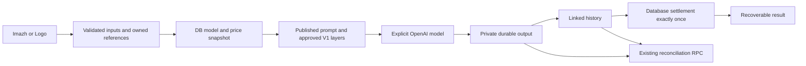

# MARO V1 — PHASE 7

## PHASE 7 STATUS

**PASS — conservative cleanup and launch-readiness audit completed. Public launch remains blocked.**

Audited on 2026-09-17 from the accepted Phase 6 working tree. The owner confirmed **Railway** as the production host. No deployment, payment implementation, payment schema change, paid generation, production configuration write, historical migration rewrite or broad refactor occurred. Existing unrelated working-tree changes were preserved.

## FINAL V1 ARCHITECTURE

`src/app/api/ai/image/route.ts` is the only ordinary V1 image-provider entry point. It parses and resolves the trusted request, compiles the canonical prompt, reserves the configured credits, records the private execution trace and forwards the snapshot's provider model explicitly. Storage and history must succeed before settlement. Auxiliary telemetry cannot undo a committed charge. Reference editing and text-to-image use the same request, compiler, price and persistence contract.

No production branch imports `imageExecution`, `imageCompile`, `loadCompileContext`, shadow scheduling, canary selection or legacy prompt composition. Existing route tests place spies on those alternatives and verify they are not called.

## CLEANUP PERFORMED

| Removed or corrected | Evidence and replacement | Future/history impact |
|---|---|---|
| Unused `IMAGE_MODEL` export and its `OPENAI_IMAGE_MODEL` fallback in `src/lib/ai/openai.ts` | Reference search found no production consumer. Both provider methods require `opts.model`; the trusted DB snapshot supplies it. Removed the misleading setting from `.env.example`. | No Web/V2 consumer or historical-data dependency. Existing local environment value was left untouched and is inert. |
| Client Logo brief compilation in `src/lib/marologo/generation.ts` | The client now sends an empty compatibility prompt plus structured Wizard answers. The server already discarded that prompt and compiles the brief from validated answers. | The server brief builder, structured field keys, references and request signature remain. Preserved tools/fixtures still call the same request helper. |
| Raw database job-creation details returned by `prepareGeneration` | `createJob` retains server-side diagnostics; the customer response contains only the controlled error code. A failure-injection test proves details do not escape and no credits are reserved. | Existing duplicate-job IDs and guard behavior remain. No payment code changed. |
| Full metadata/diagnostics in owner V1 job polling | `/api/jobs/[id]` returns an explicit lifecycle/credit/timestamp projection for durable V1 jobs. Authentication and owner checks remain; three tests cover privacy and denial. | Historical non-V1 response behavior is preserved. No current browser consumer requires V1 metadata. |
| Generic presentation of persistence/settlement errors | Both image interfaces use shared customer-safe messages. Pending settlement says the saved result is being finalized and directs the user to history; it does not claim a refund or invite immediate regeneration. Released provider/storage/history failures say the reservation was released. | Financial behavior is unchanged; these messages describe the existing route outcomes. |
| Build-blocking local variables named `module` | Renamed local variables in model projection, availability, Coming Soon UI, navigation and canonical tests. No rule was disabled. | No semantic or public API change. |

Phase 7 files changed: `.env.example`; `src/lib/ai/openai.ts`; `src/lib/ai/imageTypes.ts` (correct contract comments); `src/lib/marologo/generation.ts`; `src/lib/generation/orchestrator.ts`; `src/app/api/jobs/[id]/route.ts`; `src/lib/services/imageErrors.ts`; `src/components/app/ToolComposer.tsx`; `src/components/marologo/MaroLogoWizard.tsx`; `src/app/api/ai/image/models/route.ts`; `src/components/modules/ModuleComingSoon.tsx`; `src/lib/modules/availability.ts`; `src/lib/nav/destinations.ts`; `src/lib/__tests__/v1-canonical-prompt.test.ts`; `src/lib/__tests__/credit-lifecycle.test.ts`; `src/lib/__tests__/image-reference-pipeline.test.ts`; `src/lib/__tests__/v1-job-projection.test.ts`; `tools/phase7/database.mjs`; `tools/phase7/environment.mjs`; `tools/phase7/browser.mjs`; `tools/phase7/stored-result.mjs`; this report. The four tools provide repeatable audit evidence; they are not application execution paths. Paths are relative to `C:/Users/nicep/Desktop/maro-al/maro-al`.

## RETAINED FUTURE CODE

Classification was based on references before removal, rather than deleting entire old subsystems.

| Candidate | Classification | Reason |
|---|---|---|
| Old Imazh composition / `assembleImageFlatPrompt` | KEEP TEMPORARILY / NEEDS MORE EVIDENCE | Used by retained Engine comparisons, parity fixtures and legacy composition. Absent from normal V1 execution. |
| `imageCompile` | KEEP TEMPORARILY / NEEDS MORE EVIDENCE | Shared reference normalization/types, adapter contracts, diagnostic compiler and parity tools still import it. |
| Older Engine compiler | KEEP FOR V1.5 | Web dry runs, parity and retained Web implementation use it; V1 admin selects the canonical builder explicitly. |
| Old global image-model default | REMOVE NOW | Removed unused environment fallback as described above. |
| Runtime `tool_prompts` reads / settings fallback | KEEP FOR V1.5 / V2 | Blocked Web, Audio and Chat routes, Engine seeding and historical compatibility still consume them. Canonical V1 does not. |
| Registry models / `default_model_id` | KEEP FOR HISTORICAL COMPATIBILITY | Retained Engine admin/diagnostics use them. V1 queries only logical `flare`/`sunburst` rows, validates exactly one enabled default and never reads the Engine default field. |
| Shadow execution selection | KEEP TEMPORARILY / NEEDS MORE EVIDENCE | Diagnostic tests and historical comparison tools remain. No active V1 call site. |
| Canary / internal-engine switching | KEEP FOR V1.5 | Preserved Web execution and diagnostic tooling still depend on it. Code release policy blocks ordinary Web execution. |
| Registry prices / legacy pricing helpers | KEEP FOR V1.5 / V2 | Shared future-tool composer and old compiler use them. Active image UI takes the model projection price and the server takes the frozen model price. |
| Disconnected Engine controls / feature-flag controls | KEEP TEMPORARILY / NEEDS MORE EVIDENCE | Hidden from normal V1 navigation or separated into developer/future workspaces by Phase 6. Direct admin endpoints remain permission/MFA protected and cannot override V1 release policy. |
| Client-authoritative Logo prompt remnant | REMOVE NOW | Removed client compilation; server-only canonical instructions remain. |
| Old Brain mapping / migration source-of-truth matrix | KEEP FOR V1.5 / HISTORICAL COMPATIBILITY | Exported diagnostic material; not displayed as V1 operational truth. Normal Brain admin shows the actual workspace-owned behavior. |
| Fort, Web presets and future modules | KEEP FOR V1.5 / V2 | Explicitly preserved product work. No data deletion or automatic orphan cleanup. |

## MODEL SOURCE OF TRUTH

`loadV1ImageModelRows` reads `tool_model_configs` with `model_id IN ('flare','sunburst')`. Validation rejects unsupported provider IDs, invalid prices, duplicate/default ambiguity and Logo Sunburst. Omitted Imazh choices resolve from the enabled DB default. Explicit disabled choices fail before billing.

The provider adapter receives the resolved ID; there is no environment override or silent fallback. Old `gpt-image-2` rows are still present/enabled in the legacy catalog, but the V1 query excludes them. They were not modified because retained historical/Engine consumers exist. `OPENAI_IMAGE_MODEL` remains present in the local environment with **zero runtime consumers** after cleanup.

## PRICING SOURCE OF TRUTH

Read-only Supabase inspection and the actual local public projection confirmed:

| Product/model | Enabled | Default | Customer credits | Provider model |
|---|---|---|---|---|
| Imazh Flare | Yes | Yes | 5 | `gpt-image-2.5-flare` |
| Imazh Sunburst | Yes | No | 5 | `gpt-image-2.5-sunburst` |
| Logo Flare | Yes | Sole model | 5 | `gpt-image-2.5-flare` |

Descriptors remain `Fast · Recommended` and `Alternative · More deliberate`. Customer price comes from `cost_metadata.customerCredits`, through the safe projection and immutable request snapshot to reservation, history and settlement. Provider-cost estimates are auxiliary accounting, not another customer price calculator. Missing display configuration disables generation rather than authorizing a zero-cost request. The existing six-credit admin/route/database tests still pass; all temporary configuration changes occur in isolated fixtures.

## PROMPT SOURCE OF TRUTH

Published `system_prompt_versions`, approved live `v1.production.*` layers, validated input, an applicable published Preset, and explicit Imazh Brain opt-in are the only canonical instruction sources. Logo uses validated Wizard answers and always excludes Brain. Client prompt injection, Logo Sunburst and conflicting structural answers are rejected or excluded by the existing trusted boundary.

Published versions remain Imazh `v1` and Logo `v1-canonical-phase4`. Draft save, canonical preview, atomic publish and rollback retain their existing tests. No live prompt was changed. Brain is owner/workspace scoped; OFF means no Brain context. The opt-in is shown when an authenticated workspace has configured Brain, not to logged-out visitors.

## ADMIN SOURCE OF TRUTH

Phase 6 controls remain intact: Overview; Imazh models/default/enabled/labels/descriptors/credits, prompt drafts/publication and approved layers; Logo Flare price, canonical prompt and existing Wizard content; workspace Brain visibility; existing Presets; durable Generations and guarded reconciliation. Owner changes flow through validated APIs to the same tables used by the runtime. No new settings store or compiler was introduced.

Manual reconciliation still requires permission, MFA, an eligible V1 job and the existing 15-minute stale threshold. It delegates to the database RPC, with no alternate financial algorithm. Completed/released jobs are terminal. Orphans remain visible and are not deleted.

## MODULE AVAILABILITY

LIVE: Imazh, Logo, Brain and Presets. Only Imazh and Logo generate. Web remains V1.5; Filma, Audio/Zo, Marketing and Fort remain V2; standalone Chat remains parked. Direct requests to all five preserved Web/edit/Audio/Chat generation endpoints return 403 before provider execution. Image requests also apply the code policy to aliases, manipulated payloads and unknown modules. DB/admin toggles cannot make parked modules live.

## PUBLIC/API ROUTE AUDIT

| Route / surface | Classification | Authority and effect |
|---|---|---|
| `POST /api/ai/image` | V1 active | Authenticated trusted request, canonical model/price/prompt, durable lifecycle. Only normal image-provider entry point. |
| `GET /api/ai/image/models` | V1 active, public-safe read | Approved enabled product model projection; no provider IDs, private metadata or generation. |
| `GET /api/ai/image/logo-content` | V1 active, public-safe read | Validated fixed Wizard content, no structural authority from the client. |
| `POST /api/ai/generate`, `/edit`, `/edit-html` | Future blocked | Web V1.5 code guard precedes provider/billing work. |
| `POST /api/ai/audio`, `/chat` | Future blocked | Audio/Chat code guard precedes provider/billing work. |
| `/api/creations` | V1/history | Authenticated owned history, signed media, favourite/title/delete operations. Does not generate or charge. Older column/URL compatibility retained. |
| `/api/jobs/[id]` | V1/history | Authenticated owner-only state; V1 projection now excludes raw metadata. |
| `/api/media/resolve`, `/api/projects/assets`, `/api/workspaces/assets` | V1/internal asset plumbing | Ownership, reference/storage validation and existing upload limits; no AI execution. |
| `/api/projects/thumbnail` | Historical/internal, V1.5 | Captures existing Web HTML only with a valid capture token bound to owner, generation, workspace and HTML. No OpenAI call or new Web generation. Preserved for existing results. |
| `/api/explore`, `/api/prompts`, `/api/prompts/[id]`, `/api/prompts/reveal` | V1 discovery/Presets | Safe projections and existing access controls. A Preset cannot enable a parked generator. |
| `/api/admin/engine/compile` | Admin-only | Permission/MFA-protected canonical V1 preview; legacy compiler only for future diagnostics. No provider call. |
| `/api/admin/engine/tools/*`, `/api/admin/engine/system-prompts/*` | Admin-only | Operational model/layer/draft/publication APIs; retained future endpoints remain separate. |
| `/api/admin/v1/configuration`, `/logo-content`, `/operations` | Admin-only | Existing permission/MFA gates; operations POST alone delegates reconciliation. |
| `/api/admin/engine/seed`, `/shadow-comparisons`, `/api/admin/operations/flags` | Admin-only diagnostics/future | No ordinary V1 execution selection. Retained; not promoted into operational navigation. |
| `/api/cron/reconcile-stale-jobs` | Privileged internal | GET/POST bearer-secret authorization and existing database reconciliation. No provider call. |
| Other cron retention/temp/reminder endpoints | Privileged internal | Existing maintenance; no V1 image provider execution. Payment-related reminder implementation untouched. |

Search covered all `src/app/api` route handlers and server provider entry points. No additional public AI execution endpoint was found. No route was deleted where preserved functionality or historical compatibility remained.

## ENVIRONMENT READINESS

Presence below means **local `.env.local` or the audit process only**. Railway production variables, provider-side auth/email configuration and domains were not accessible/verified. No secret values were printed. Public-safe keys still require appropriate Supabase RLS.

| Variable | Local presence | Classification / V1 use |
|---|---|---|
| `NEXT_PUBLIC_SUPABASE_URL` | Present | Required, public-safe; browser/server auth, data and storage |
| `NEXT_PUBLIC_SUPABASE_ANON_KEY` | Present | Required, public-safe; user auth and RLS-scoped access |
| `SUPABASE_SERVICE_ROLE_KEY` | Present | Required, secret, server only; trusted config, durable RPCs, admin, storage signing |
| `OPENAI_API_KEY` | Present | Required, secret; image adapter |
| `OPENAI_TIMEOUT_MS` | Absent | Optional, nonsecret; defaults to existing image execution budget |
| `OPENAI_IMAGE_MODEL` | Present | Obsolete, nonsecret; no runtime consumer; remove from deployment settings during authorized preparation |
| `CRON_SECRET` | Absent | Required for production reconciliation, secret; endpoint fails closed without it |
| `APP_ORIGIN` | Absent | Optional public-safe origin override; preferred explicit production configuration |
| `NEXT_PUBLIC_APP_URL` | Absent | Optional public-safe origin/email/billing link configuration |
| `APP_URL`, `NEXT_PUBLIC_SITE_URL` | Absent | Optional compatibility origin aliases; default trusted production origin is `https://maro.al` |
| `NEXT_PUBLIC_SIGNUP_ENABLED` | Absent | Public-safe release setting; absent means signup disabled; configure deliberately before public onboarding |
| `NEXT_PUBLIC_TURNSTILE_SITE_KEY` | Absent | Required with production signup, public-safe; CAPTCHA widget |
| `TURNSTILE_SECRET_KEY` | Absent | Required with production signup, secret; server CAPTCHA verification |
| `RESEND_API_KEY` | Absent | Secret; required for the configured application email provider |
| `SUPABASE_AUTH_HOOK_SECRET` | Absent | Secret; required when Supabase routes auth email through the application's hook |
| `PUBLIC_LAUNCH_MODE` | Absent | Optional, nonsecret; default live. Walkthrough used a process-only live setting; no production gate changed. |
| `THUMBNAIL_SIGNING_SECRET` | Absent | Optional secret for preserved Web capture tokens; existing service-role fallback retained |
| `NODE_ENV`, `PORT`, `HOSTNAME` | Absent locally | Platform/runtime settings; Next sets production mode, Railway supplies the port, start script binds the web service |
| `ANTHROPIC_API_KEY` | Present | Secret, future Web; not used by V1 generation |
| `ANTHROPIC_MODEL`, `ANTHROPIC_EFFORT` | Present | Nonsecret, future Web configuration |
| `ANTHROPIC_MAX_TOKENS`, `ANTHROPIC_TIMEOUT_MS` | Absent | Optional, future Web |
| `ANTHROPIC_CHAT_API_KEY` | Absent | Secret, future standalone Chat |
| `ANTHROPIC_CHAT_MODEL`, `ANTHROPIC_CHAT_MAX_TOKENS` | Absent | Nonsecret, future Chat |
| `ELEVENLABS_API_KEY` | Absent | Secret, future Audio |
| `ELEVEN_VOICE_FEMALE`, `ELEVEN_VOICE_MALE` | Absent | Nonsecret, future Audio |
| `PAYMENT_MODE` | Absent | Payment-only, frozen; production treats missing mode as invalid. Requires separate payment finalization. |
| `VERCEL_OIDC_TOKEN` | Present in audit environment | Secret tooling credential, no application consumer; unrelated to Railway runtime |

Storage bucket names are code constants (`generations` private and `maro-public` public), not a second storage provider's environment. Admin permissions/MFA come from the existing Supabase identity and security architecture; no environment bypass was introduced. No Raiffeisen credential variable consumer was found in application source; the integration remains frozen and unimplemented here.

## PRODUCTION BUILD

Initial compilation exposed seven Next lint errors from local variables named `module`; all were corrected without disabling lint. The post-cleanup build passed, including admin, image routes and Coming Soon pages, generating 89 static route artifacts. Explicit TypeScript checking passed.

Final build with server secrets cleared: **PASSED, exit 0; 89/89 static route artifacts generated**. OpenAI, Supabase service-role, Anthropic, Resend, cron and auth/CAPTCHA secrets were cleared for this build; no live secret was required to compile. Public Supabase configuration remains a build-time requirement for a functioning browser bundle; server credentials must be supplied at runtime. One preexisting, nonblocking `react-hooks/exhaustive-deps` warning remains in `src/components/app/cards.tsx:484` for view telemetry. It does not affect image persistence or settlement and was not cosmetically refactored.

## TEST RESULTS

- Full final regression: **946 passed, 11 skipped, 957 total; 67 files passed, 1 skipped, 68 total**. Skipped existing tests were not reclassified as passing.
- TypeScript `tsc --noEmit --incremental false`: **passed, exit 0**.
- Real isolated PostgreSQL 17 Phase 5 lifecycle suite: **15/15 passed**.
- Real isolated PostgreSQL 17 Phase 6 admin/configuration suite: **16/16 passed**.
- Phase 6 synthetic admin/Logo browser interactions: **5/5 passed**, external network blocked.
- Actual local built-product/API walkthrough: **23/23 passed**, no JavaScript runtime errors, no provider requests.
- Existing private synthetic result: **rendered at 1024×1024**, stored history/job linkage and 5-credit price verified.
- Provider calls **0**; production model/prompt/Wizard edits **0**; live credit mutations **0**.

All final checks above ran after the last application cleanup. Both database suites were repeated against fresh isolated databases, and both browser suites were repeated against the final build where applicable; all passed. Test harness corrections were needed for the admin gate's existing 403 status, a local test-string encoding issue and Logo's coin-icon cost display. These were assertion/harness issues; no app behavior was changed to satisfy them. A transient Supabase `JWT issued at future` read rejection cleared on retry; the successful readiness check was used as evidence.

## DATABASE / MIGRATION READINESS

All migration files 0001–0049 are present with no numeric gap. No migration was added or rewritten in Phase 7. Accepted application through 0049 is supported by the owner's confirmations and read-only runtime evidence: lifecycle version **2**, successful 0048 text-workspace recovery history, accessible Logo content column and working 0049 operations projection. Direct SQL migration-ledger access was not available, so this is runtime/schema evidence rather than a claim that every historical migration ledger entry was independently read.

Live operations reports two relevant jobs: completed recovery `e010ed82-07a4-40b7-86a4-8b4048f33d6a` with stored output, saved history and charged 5/reserved 0; original `68300176-1c4e-4735-b98b-cce0c102cbc4` with missing history, retained output and released/charged 0/reserved 0. There are zero pending, stale or settlement-pending jobs in this projection. The failed retained object is not a purchased success. Synthetic PostgreSQL tests cover saved-but-unsettled work, concurrent reconciliation, one charge, missing evidence and rollback.

Legacy column and signed/public URL compatibility remains where shared history/Web consumers still depend on it. No successful V1 path silently falls back to an old model, prompt or price because a migration is missing.

## MFA ADMIN VERIFICATION

**Remaining limitation.** Browser inventory contained no existing authenticated Maro session. No session was fabricated, no MFA bypass was attempted, and no production admin edits were performed. Actual unauthenticated admin requests returned the expected 403. Existing permission/MFA route tests, canonical preview parity tests, isolated database authorization tests and synthetic admin UI checks passed. A real signed-in admin configuration read and no-provider preview remain a prelaunch verification item; the brief explicitly allows retaining this limitation.

## SCHEDULER VERIFICATION

**CONFIGURATION BLOCKER for the confirmed Railway host.** The source endpoint and database algorithm are ready, but the checked-in ten-minute trigger is only in `vercel.json`. `railway.toml` configures the persistent web service (`pnpm start`, health check `/`) and contains no scheduled service. Vercel cron configuration is not Railway scheduling evidence.

The endpoint is `/api/cron/reconcile-stale-jobs`, supports GET and POST, requires a matching bearer `CRON_SECRET` in production, selects in-flight jobs older than 15 minutes and calls the accepted reconciliation RPC. Local production requests without the secret fail closed with 503. Launch gating explicitly permits cron paths. No live reconciliation was invoked during this audit.

Before public launch, configure a separate Railway scheduled task (or an explicitly managed external scheduler) to invoke this endpoint every ten minutes using the matching secret. A Railway scheduled service must run its task and exit; applying a cron schedule to the persistent web server is not sufficient. Keep the secret in platform settings, not source or URL query parameters. Railway's [cron documentation](https://docs.railway.com/cron-jobs) describes the separate run-and-exit service model; the current Vercel mechanism is documented in [Vercel cron management](https://vercel.com/docs/cron-jobs/manage-cron-jobs).

Required deployment evidence: configured schedule, successful authenticated delivery, rejection of unauthorized requests, durable stale-job outcome and no duplicate charge. No claim is made that scheduler delivery currently works. No deployment/settings change was made solely to verify this.

## USER-FACING WALKTHROUGH

The actual production build ran locally at `127.0.0.1:3007` with real read-only Supabase configuration. Desktop screenshots and a narrow in-app-browser inspection showed the existing light product theme.

- Hub: Imazh and Logo available; Web/Filma/Audio/Marketing presented as future; Presets visible; no Fort controls.
- Imazh: prompt, reference attachment, Flare default, Flare/Sunburst menu with both approved descriptors and 5-credit prices; Preset cards rendered. Brain requires a configured signed-in workspace, so its authenticated opt-in was verified in source/tests rather than claimed from the logged-out browser.
- Logo: content loads from the new settings path; three steps work with synthetic local answers; personality/type/concept/presentation controls remain; generation button shows coin icon and 5; no Brain or model selector. Generation was never clicked.
- Brain and Presets: actual pages render. Workspace ownership/Brain injection and attached Preset authorization remain covered by tests. No user's private Brain was edited.
- Coming Soon: Web, Filma, Audio and Marketing pages render and their generation APIs remain denied.
- History: logged-out empty state renders truthfully. The existing approved synthetic result separately renders through a fresh private signed URL and remains linked to its durable history row. A real signed-in owner-history walkthrough remains unverified; service-role storage inspection is not represented as that test.

Evidence is in ignored `scripts/phase7-data` and Phase 5/6 result files. Signed URLs and credential values are not serialized into the reports.

## REMAINING BLOCKERS

| Category | Item | Required closure |
|---|---|---|
| BLOCKER — deployment configuration | Confirmed Railway host has no verified ten-minute reconciliation trigger; current source schedule is Vercel-only | Configure the Railway-compatible task and secret, then verify delivery and lifecycle outcome after authorized deployment |
| BLOCKER — production verification | Railway environment, public origin, storage/auth configuration and signup/email flow not verified; local signup is disabled and CAPTCHA/email variables are absent | Inventory actual platform values without exposing secrets; configure required onboarding/security values and verify the intended signup/recovery flow before public onboarding |
| EXTERNAL BLOCKER | Raiffeisen approval and payment-integration finalization | Separate owner-authorized payment work after approval; untouched here |
| Prelaunch verification limitation | Real admin MFA configuration read/preview and signed-in owner history | Use a valid user session; no provider spend needed; not a standalone reason to block the whole audit |
| POST-LAUNCH / V1.1 | Nonblocking view-telemetry hook warning, additional diagnostics cleanup, richer scheduler audit history, deliberate retained-orphan cleanup | Defer; no aggressive deletion or architectural rewrite |
| V1.5 | Web compiler, generation/edit routes, presets and historical previews | Preserve until the Web release |
| V2 / future | Fort, Audio, Filma, Marketing, standalone Chat and related diagnostic configuration | Preserve, keep unavailable under code policy |

No unresolved failure of the tested V1 model/prompt/persistence/settlement contract was observed. Local presence does not prove that production credentials are missing; their production status is **unknown**. The definite mismatch is the scheduler host configuration.

## FINAL VERDICT

**NOT TECHNICALLY READY**

The generation implementation, admin controls, conservative cleanup and local checks pass. The confirmed Railway scheduler gap is a launch-critical configuration issue, beyond merely waiting to observe an already-configured scheduler. Production onboarding/environment checks also remain open. This verdict does not request another provider benchmark or a redo of accepted phases.

## NEXT STEP

Product-owner review of this report, followed by explicit authorization for deployment preparation that closes the Railway scheduler and production environment checks. **Do not deploy or begin Raiffeisen work automatically.**
